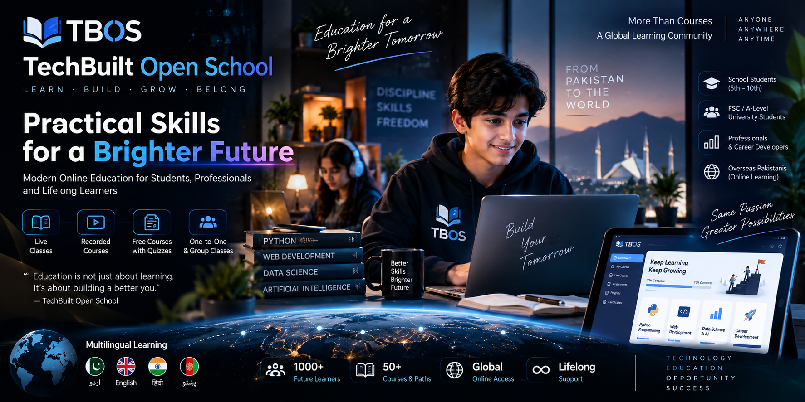
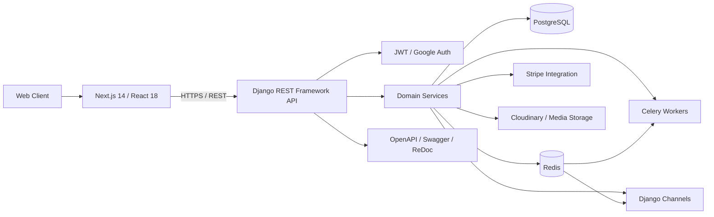

<p align="center">
  
</p>


<div align="center">

# TechBuilt Open School — Legacy LMS

### Previous-Generation Full-Stack Learning Management Platform

**Django REST Framework · Next.js · React · PostgreSQL · Redis · Celery**

A previous-generation TBOS LMS codebase demonstrating course delivery, assessments, enrollments, payments, analytics, certificates, notifications, and role-oriented learning workflows. The current long-term TechBuilt Open School platform is being rebuilt separately in `TechBuilt_Open_School`.

<p>
  
  
  
  
  
  
</p>

</div>

---

## Repository Positioning

> **Legacy / portfolio reference:** this repository represents an earlier TBOS LMS implementation. The current organization platform is being developed separately in [`TechBuilt_Open_School`](https://github.com/Shahriyar-Kh/TechBuilt_Open_School) with a new governed architecture and phased product roadmap. This repository remains useful as historical engineering evidence and is not presented as the current TBOS production codebase.

## Overview

This earlier **TechBuilt Open School (TBOS)** implementation is a full-stack learning-management platform organized as a Django/DRF backend and a Next.js frontend.

The repository demonstrates how a multi-domain education product can be structured around clear application boundaries instead of a single monolithic feature module. The backend separates accounts, courses, lessons, videos, quizzes, assignments, enrollments, payments, reviews, analytics, AI tools, certificates, and notifications into focused Django applications.

### Engineering focus

- **Modular backend design** with domain-specific Django apps
- **Versioned REST APIs** with OpenAPI documentation
- **JWT authentication** with refresh-token rotation and blacklisting
- **Role-oriented workflows** for admin, instructor, and student use cases
- **Background processing** with Celery and Redis
- **Caching / realtime infrastructure** through Redis and Django Channels
- **Frontend state and data fetching** with TanStack Query and Zustand
- **Form validation** with React Hook Form and Zod
- **Automated backend testing** with pytest and pytest-django
- **Production-oriented configuration** separated from local development settings

---

## Architecture



### Backend layering

The domain apps use a simple separation of responsibilities:

```text
Views / API layer
        ↓
Services / business logic
        ↓
Models / persistence
```

This keeps HTTP handling, business rules, and database concerns easier to reason about independently.

---

## Core Product Domains

| Domain | Responsibility |
|---|---|
| Accounts | Users, profiles, authentication, identity workflows |
| Courses | Course catalog and course management |
| Lessons & Videos | Learning content and media delivery |
| Quizzes | Assessments and quiz workflows |
| Assignments | Assignment publishing and submissions |
| Enrollments | Enrollment and learner progress |
| Payments | Payment-related workflows and Stripe integration |
| Reviews | Course ratings and feedback |
| Analytics | Platform and learning analytics |
| AI Tools | AI-assisted platform capabilities |
| Certificates | Completion-certificate workflows |
| Notifications | User notification workflows |

---

## API & Backend Capabilities

The backend is built with **Django 5.1.3** and **Django REST Framework 3.15.2**.

### API design

- Current API namespace: `/api/v1/`
- OpenAPI schema generation with **drf-spectacular**
- Swagger UI and ReDoc documentation
- Pagination, filtering, search, and ordering
- Standardized success/error response handling
- URL-versioning support with a reserved `v2` namespace
- Separate admin, instructor, and student API workflows

### Authentication & security

- JWT authentication via Simple JWT
- 15-minute access-token lifetime
- Refresh-token rotation
- Refresh-token blacklisting after rotation
- Google authentication support through django-allauth
- Default authenticated API access
- DRF throttling and endpoint-specific rate-limiting support
- Environment-based secret configuration
- Security middleware and production-oriented HTTPS settings

---

## Frontend Engineering

The frontend lives in `tbos-frontend/` and uses:

- **Next.js 14.2**
- **React 18.3**
- **TypeScript**
- **Tailwind CSS**
- **TanStack Query** for server-state management
- **Zustand** for client-state management
- **Axios** for HTTP communication
- **React Hook Form + Zod** for forms and validation
- **Radix UI** primitives
- **Framer Motion** for interface motion

Available frontend scripts include development, production build, linting, and TypeScript type-checking.

---

## Platform Stack

| Layer | Technology |
|---|---|
| Backend | Python, Django, Django REST Framework |
| Frontend | Next.js, React, TypeScript, Tailwind CSS |
| Database | PostgreSQL; SQLite for local development |
| Authentication | Simple JWT, django-allauth, Google OAuth support |
| Cache / Broker | Redis |
| Async Tasks | Celery |
| Realtime Support | Django Channels + channels-redis |
| API Docs | OpenAPI 3, Swagger UI, ReDoc |
| Media | Cloudinary integration; media-storage configuration |
| Payments | Stripe integration |
| Testing | pytest, pytest-django, pytest-cov |
| Deployment Runtime | Gunicorn, WhiteNoise |

---

## Repository Structure

```text
TBOS/
├── .env.example
├── requirements.txt
├── README.md
│
├── TBOS_Backend/
│   ├── manage.py
│   ├── pytest.ini
│   ├── api_schema.yml
│   ├── config/
│   │   ├── settings/
│   │   │   ├── base.py
│   │   │   ├── development.py
│   │   │   └── production.py
│   │   ├── api_router.py
│   │   ├── celery.py
│   │   └── urls.py
│   ├── apps/
│   │   ├── accounts/
│   │   ├── courses/
│   │   ├── lessons/
│   │   ├── videos/
│   │   ├── quiz/
│   │   ├── assignments/
│   │   ├── enrollments/
│   │   ├── payments/
│   │   ├── reviews/
│   │   ├── analytics/
│   │   ├── ai_tools/
│   │   ├── certificates/
│   │   └── notifications/
│   ├── scripts/
│   └── tests/
│
└── tbos-frontend/
    ├── package.json
    └── ...
```

---

## Local Development

### Prerequisites

- Python 3.11+
- Node.js 18+
- npm
- Redis for async/cache features
- PostgreSQL for a production-like database setup

### 1. Clone the repository

```bash
git clone https://github.com/Shahriyar-Kh/TBOS.git
cd TBOS
```

### 2. Configure the backend

Create and activate a virtual environment:

```bash
python -m venv .venv
```

Windows:

```bash
.venv\Scripts\activate
```

macOS / Linux:

```bash
source .venv/bin/activate
```

Install dependencies and create the local environment file:

```bash
pip install -r requirements.txt
cp .env.example .env
```

Set development settings in `.env` and replace all placeholder values with your own local credentials.

Run migrations and start Django:

```bash
cd TBOS_Backend
python manage.py migrate
python manage.py runserver
```

### 3. Start the frontend

From a second terminal:

```bash
cd tbos-frontend
npm install
npm run dev
```

### 4. Optional background worker

With Redis running:

```bash
cd TBOS_Backend
celery -A config worker -l info
```

---

## API Documentation

When the backend is running, the project exposes its generated API documentation through the configured schema and documentation routes.

| Route | Purpose |
|---|---|
| `/api/v1/` | Versioned API root |
| `/api/schema/` | OpenAPI schema |
| `/api/docs/` | Swagger UI |
| `/api/redoc/` | ReDoc |

The repository also contains the generated OpenAPI specification at:

```text
TBOS_Backend/api_schema.yml
```

---

## Testing & Quality Checks

Backend tests use pytest:

```bash
cd TBOS_Backend
pytest
```

Coverage tooling is available through `pytest-cov`.

Frontend quality commands:

```bash
cd tbos-frontend
npm run lint
npm run type-check
npm run build
```

The README intentionally avoids publishing unverified coverage percentages, traffic claims, user counts, or scale claims. Engineering claims here are tied to the current repository configuration and source structure.

---

## Configuration & Secrets

A safe template is provided in `.env.example` for configuration such as:

- Django and JWT secrets
- PostgreSQL connection settings
- frontend/CORS/CSRF origins
- SMTP credentials
- Google OAuth credentials
- Stripe keys
- Cloudinary settings
- Redis and Celery URLs

> Never commit a real `.env`, API key, token, password, or production credential.

---

## Operational Scripts

The backend includes scripts for common administrative workflows:

```bash
cd TBOS_Backend

python scripts/create_admin.py
python scripts/seed_database.py
python scripts/import_courses.py
```

---

## Engineering Evidence

For reviewers evaluating this project, useful implementation entry points include:

- `TBOS_Backend/apps/` — domain-oriented Django applications
- `TBOS_Backend/config/settings/` — environment-separated configuration
- `TBOS_Backend/api_schema.yml` — generated API contract
- `TBOS_Backend/tests/` — backend test suite
- `tbos-frontend/package.json` — verified frontend stack and quality scripts
- `.env.example` — configuration contract without real credentials

---

## Project Status

TBOS is maintained as an engineering portfolio project and learning-management platform codebase.

This README documents capabilities visible in the repository rather than making unsupported claims about production traffic, user volume, or infrastructure scale.

---

## Author

**Shahriyar Khan**  
Software Engineer · Full-Stack Python Developer

**Core focus:** Python · Django · Django REST Framework · FastAPI · React / Next.js · PostgreSQL

- GitHub: [@Shahriyar-Kh](https://github.com/Shahriyar-Kh)
- Portfolio: [shahriyarkhan.com](https://shahriyarkhan.com)
- LinkedIn: [Shahriyar Khan](https://www.linkedin.com/in/shahriyar-khan-developer/)

---

<div align="center">

**Built as evidence of full-stack Python engineering, API design, modular application architecture, and modern frontend integration.**

</div>
